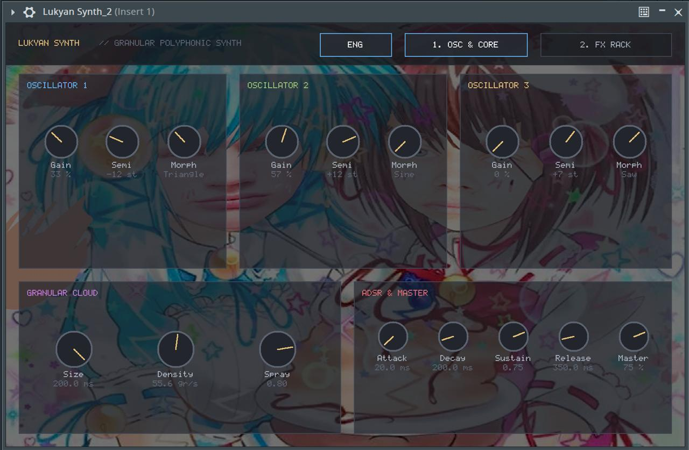

# Lukyan Synth (Лукьян Синт)

Полифонический гранулярный синтезатор реального времени, разработанный на языке C11 в формате плагина CLAP с возможностью трансляции в VST3.

## Авторство
* ФИО: Малых Кирилл Романович
* Группа: P3232
* ИСУ: 502873

## Интерфейс плагина

### Вкладка 1: Осцилляторы и гранулярный движок


### Вкладка 2: Рэк эффектов


## Описание проекта и возможностей

Lukyan Synth объединяет многогенераторный синтез с непрерывным морфингом формы волны, гранулярную обработку в реальном времени и встроенную цепочку пространственных эффектов:

* 3 независимых осциллятора: каждый генератор настраивается отдельно (громкость, смещение строя в пределах от -24 до +24 полутонов и плавный регулятор формы волны между синусом, треугольником, пилой и квадратом).
* Гранулярное ядро: статический пул на 256 зёрен с наложением окна Хэнна для устранения щелчков, регулировкой длины зёрен, плотности генерации и случайного разброса позиции считывания.
* 16-голосная полифония: поддержка одновременного звучания аккордов с циклическим алгоритмом голосокрадства.
* Огибающая ADSR: поканальная 4-фазная огибающая громкости.
* Цепочка встроенных эффектов:
  * Резонансный фильтр низких частот с регулировкой среза и резонанса.
  * Модуль Lo-Fi: биткрашер от 16 до 4 бит и прореживание частоты.
  * 4-каскадный стерео-фазер с LFO-модуляцией и обратной связью.
  * Пространственный стерео-хорус на линии задержки.
  * Алгоритмический стерео-ревербератор Шрёдера с демпфированием.
* Графический интерфейс:
  * Встроенный растровый шрифт с поддержкой кириллицы.
  * Динамическое переключение языка интерфейса между стилизованным русским и стандартным английским.
* Безопасность реального времени: вся память выделяется один раз при старте, в аудиопотоке полностью отсутствуют динамические аллокации и блокирующие примитивы.

## Сборка и установка

### Сборка на macOS:
```bash
mkdir build && cd build
cmake ..
cmake --build .
```
Скомпилированный бандл `Lukyan Synth.clap` автоматически копируется в системную папку `~/Library/Audio/Plug-Ins/CLAP/`.

### Сборка на Windows:
```cmd
mkdir build && cd build
cmake ..
cmake --build . --config Release
```
Скомпилированный файл копируется в `C:\Program Files\Common Files\CLAP\`.

В репозитории настроен автоматический пайплайн GitHub Actions, собирающий готовые бинарники `.clap` и `.vst3` для Windows и macOS при каждом коммите.

## Совместимость с DAW
Плагин протестирован и работает в:
* FL Studio (нативно в версиях 21.2+ и 24, а также в старых версиях через VST3-бандл)
* Cockos REAPER
* Bitwig Studio